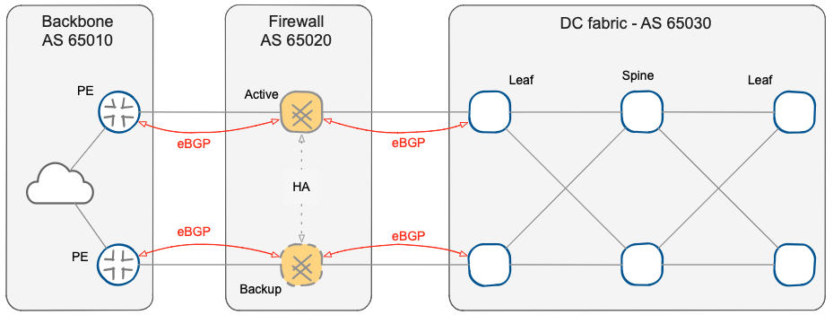
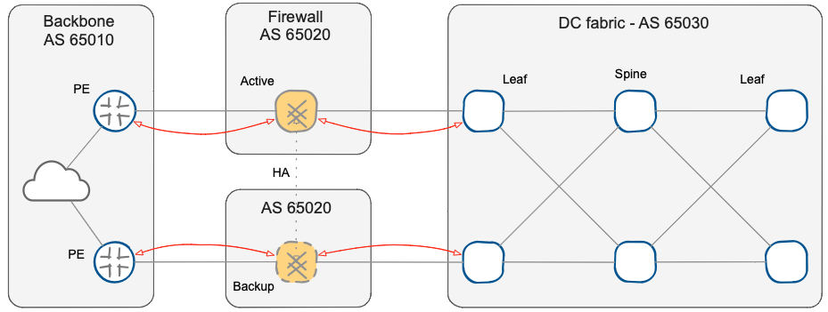

title: BGP Design

The [first part of this article](index.html) outlined the advantages of using a routing protocol to implement high availability of a firewall cluster solution. Now it’s time to identify the key design points to realize a simple, reliable, and maintainable solution.

## eBGP versus iBGP

The role of BGP in this context is to get a symmetrical traffic flow through firewall nodes in an Active-Standby fashion, and to provide a fast failover in case of a fault of any component of the active chain. BGP is a network border protocol designed to achieve a uniform convergence of traffic entering and leaving the Autonomous System (AS), rather than the path it uses within the AS. The ideal solution is to use EBGP, dedicating an AS different from the external backbone and from the data center to the firewall cluster.

The use of eBGP also solves problems like the resolution of the next-hop or the full-mesh requirement of iBGP, but above all, it makes the various zones of data center edge network (WAN backbone, firewall, and data center fabric) independent and separate.

To be precise, the two firewalls are seen as **two distinct and equal autonomous systems** &ndash; as mentioned in the [overview part](index.html), the two firewall nodes must be independent routers. All major firewall vendors support this configuration (independent or clustered nodes) in which it is possible to synchronize firewall policy and session state across the cluster members, but retain routing independence.

Finally, you might be tempted to assign a different AS to the two nodes of the firewall cluster to identify the state of the cluster solely from the AS-PATH. However, if you use the same AS number on the two nodes, BGP split-horizon mechanism automatically solves possible inconsistent or asymmetric routing problems that could be triggered by a partial failure of a firewall cluster member (for example, losing a single inside interface in a design with multiple inside interfaces).

NOTE: We'll cover additional scenarios in future posts.

## Minimal routing

To keep the solution simple, reduce the use of resources, and optimize the convergence time, we'll reduce the routing information passed through the firewall cluster to the minimum:

* WAN backbone routers will advertise the default route;
* Data center fabric edge switches will advertise the data center address block(s), preferably using a contiguous and aggregable addresses space.

This approach is particularly useful for firewalls that have not been as optimized for RIB -&gt; FIB (Routing to Forwarding Information Base) convergence time as typical routers and switches &ndahs; fewer entries in the BGP routing table will result in faster convergence. After all, the goal is to use BGP for end-to-end reachability rather than as a complete routing solution.

## Routing policy

It is now necessary to create a routing policy to achieve the symmetric traffic flow through firewalls in an Active/Standby mode, and we'll yet again make the design as simple as possible &ndash; we'll implement the solution by **concentrating all the policies on a single device**. While you could implement the routing policies in numerous ways using different BGP attributes, it's best to implement BGP policy on the data center border switch connected to the designated backup firewall node.

* We'll use BGP Local Preference attribute to choose the preferred exit point for the traffic leaving the data center. We'll use a route-map to set the Local Preference for the default route coming from the backup firewall node to 90, which is lower than the default local preference value (100) attributed to the default-route coming from the active firewall node.

NOTE: Local-preference is the BGP attribute that controls the preferred exit-point of the AS.

* We'll use AS-path prepending to control the inbound traffic from the WAN backbone. We'll insert an additional copy of the data center AS number in the AS-path of data center BGP prefixes advertised to the backup firewall node. The backup firewall node will propagate longer AS-path to the WAN backbone, and the WAN backbone routers will choose the prefix with the shortest AS path.

There are many advantages to confining policies in a single device:

*  The configurations of all devices are simpler; in particular, it is not necessary to implement BGP routing policy on the firewalls and deal with rarely-used configuration syntax or troubleshooting commands.
* It’s not necessary to synchronize BGP configuration of multiple devices to obtain the expected traffic symmetry, avoiding traffic blackholing during unsynchronized policy maintenance.
* The policies are concentrated in a single point, allowing atomic configuration changes to trigger manual failover and maintenance operations.
