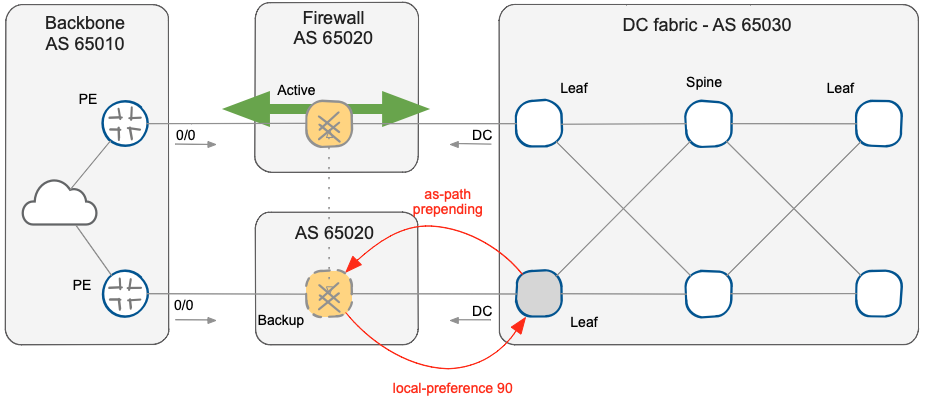

title: Firewall Upgrade Procedure

After [designing BGP routing](10-BGP-Design.md) for our [high-availability solution](index.html), let's see how we can use the new design to perform one of the most critical firewall maintenance procedures: cluster software version upgrade.

You can use the following procedure to upgrade firewall software in an active/standby firewall cluster that uses BGP to select the active path:

* Change Active/Standby role of the firewall cluster nodes by modifying the BGP routing policies (increase BGP Local Preference and reduce AS-PATH prepending). Trigger an atomic failover with a "*commit*" or "*clear bgp \* soft*" based on the platform used. State synchronization between the cluster nodes will ensure a smooth failover without session drops. Alternatively, you can also trigger the failover by forcing down any interface on the primary chain.

* The offline node (previously Active node) can be updated and restarted.
* After the restart, the upgraded node synchronizes its state with the currently active node (still running the previous version of the software). Most firewall vendors usually guarantee state synchronization across minor version upgrades; in some cases, they also support state synchronization across major version upgrades.
* The Active/Standby role can now be safely reverted, applying the original routing policy on the data center border switch and restoring the original traffic-flow without service interruption.

The upgraded node is now performing the security enforcement and traffic analysis. However, it's safe and straightforward to trigger an immediate (stateful) switchover to the previous release still loaded on the backup node in case you start experiencing problems with the upgraded software.

Once the monitoring period has been completed (which can easily spread over a few days), you can upgrade the secondary node without requiring a further maintenance window.

NOTE: This solution is particularly useful in critical environments with long-lived TCP sessions where service continuity is essential.

