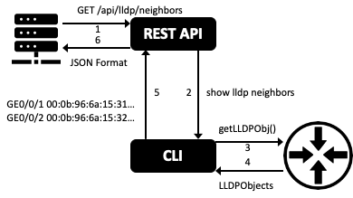
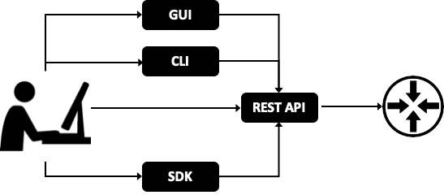

# Native Web API

In 2020 every system (including network devices, web applications, ...) should be programmable via API. Actually many vendors say that their product are programmable via API, but that's not always 100% true. In fact many products do not support what I call "complete API".

Legacy products are usually managed via web interface and/or a proprietary CLI interface. Converting a monolithic product into an API-based ones is pretty impossible. Vendors usually add an additional layer, to expose internal functions via web API. This approach requires to map every function and every output to a web format, like JSON or XML for example.

Let's see an hypothetical example: `show lldp neighbors`

<figure>
  
  <figcaption>Typical interaction with a CLI-only device</figcaption>
</figure>

1. the operator can type a command in a human readable format via CLI
2. CLI command is translated into low level machine commands
3. LLDP neighbors are retrieved in a machine format
4. Output is formatted into a human readable format and printed out via CLI.

Adding web API to this monolithic system results in an architecture like the following:

<figure>
  
  <figcaption>Adding web API in front of CLI interface</figcaption>
</figure>

1. An external application can retrieve LLDP neighbors using a REST API call using HTTP GET request
2. HTTP GET request is translated into the `show lldp neighbors` CLI command
3. CLI command is translated into low level machine commands
4. LLDP neithbors are retrieved in a machine format
5. Output is formatted into a human readable format
6. Output is formatted into JSON via "[screen scraping](https://en.wikipedia.org/wiki/Data_scraping#Screen_scraping)"

This approach allows a fast implementation of REST API on legacy products, but it is not efficient because vendor programmers need to map each CLI command to a REST API and parse (see [screen and web scraping](050-scraping.html)) the human-readable printout into a structured objects like JSON or XML document. It's obvious what could be wrong using this approach. In practice, following this method, vendors often don't offer a complete API, but just a few calls that they think might be most useful to their customers.

Modern products are built around an API-first architecture:

<figure>
  
  <figcaption>A product with an API-first architecture</figcaption>
</figure>

Using this approach every interaction is translated to and from REST API which is the only authorized method to interact with the device. It's obvious which method is more complete and less prone to bugs.

Cisco ACI is an example of product built around REST API. In fact REST API is the preferred way to build automation around "complete API" products. GUI or WEB-UI should be used only for deep troubleshooting by humans. Personally this is the approach I follow when I'm asked to automate large Cisco ACI installations.

### More to explore

* We discussed the same dilemma in [Network Automation 101](https://www.ipspace.net/Network_Automation_101) webinar
* Phil Shafer described the history of one of the first API-based network operating systems (Junos) in [Episode 85](https://blog.ipspace.net/2017/12/how-did-netconf-start-on-software-gone.html) of [Software Gone Wild](https://www.ipspace.net/Podcast/Software_Gone_Wild/) podcast.
