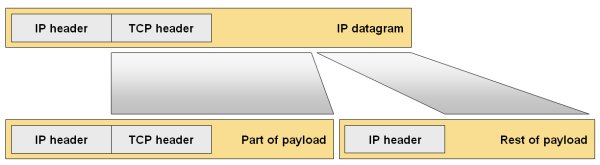

The IP protocol stack never had a reliable mechanism by which the end hosts could figure out the maximum payload size to use when communicating with a remote IPv4 host (and it’s not present in IPv6 either). The absence of the network-wide MTU mechanism is somewhat understandable, as the IP packets are routed independently of each other and different packets between the same end hosts could take different routes with varying MTU sizes. However, the lack of end-to-end information can quickly result in oversized packets being received by the intermediate routers that cannot send them onwards.

IPv4 and IPv6 protocols provide a convenient solution: the IP fragmentation, a mechanism where a single inbound IP datagram is split into two or more outbound IP datagrams. The IP header is copied from the original IP datagram into the fragments, special bits are set in the fragments’ IPv4 headers to indicate that they are not complete IP packets (IPv6 uses extension headers), and the payload is spread across the fragments (see the following diagram). IPv4 routers can fragment IP packets in transit; that capability was removed from IPv6 for performance reasons - the sending host has to perform IPv6 fragmentation if needed.

The IP fragmentation was particularly bad in the earlier Cisco IOS releases, as the routers had to make copies of the original IP packets to generate the fragments, thus forcing the IP fragmentation into the process switching path (which is significantly slower than any other switching mechanism). Later IOS releases introduced particle-based fragmentation, which allows IP fragmentation to be performed within Cisco Express Forwarding (CEF).

The IP fragmentation always increases the layer-3 overhead (and thus reduces the actual bandwidth available to user traffic). For example, if the end-host thinks it can use 1500-byte IP packets, but there is a hop in the path with MTU size 1472, each oversized IP packet will be split in two packets, resulting in an additional 20-byte IPv4 header or 40-byte IPv6 header.

Even worse, the application-layer information is missing from the non-first IP fragments, as the TCP or UDP header is not copied into all fragments. This fact has been widely used to break through firewalls using overlapping fragments where the second fragment would rewrite the TCP/UDP header from the first fragment. As a result, some firewalls might be configured to drop IP fragments (resulting in blocked communication between the end-hosts), while others have to consume additional CPU resources to reassemble the fragments and inspect their actual contents. Intrusion Detection/Prevention Systems (IDS/IPS) have to provide similar functionality to effectively detect intrusion signatures. The problem was made significantly worse with the introduction of unlimited chains of extension headers in IPv6.

Last but not least, the IP fragments impose additional burden on the receiving end-system, as it has to reassemble the fragments before they can be delivered to higher protocol layers. The situation is aggravated when the IP traffic is terminated by the router, for example when terminating GRE tunnels or encrypted traffic. If a router performs IP reassembly, the packets cannot be reassembled in hardware drastically reducing performance for platform performing hardware packet switching. Even on software-only platforms like Cisco IOS the reassembly is performed in the process switching path, resulting in significant CPU overload and dismal forwarding performance.

**End result**: if you use GRE-over-IPSec encapsulation between a pair of routers, and the GRE packet gets fragmented due to the additional IPSec header, the performance of the router receiving the fragments will fall by a factor of ten to thousand.
