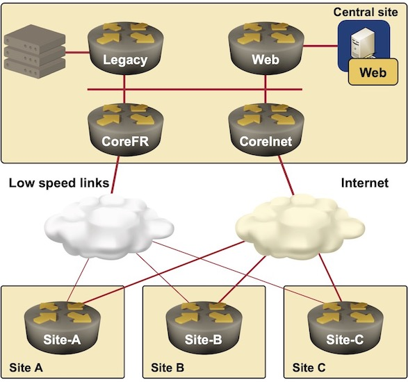

title: Scalable Policy Routing
index: yes
toc_title: Overview

If you’re serious about the high availability of your network, your remote sites have a primary and a backup link into the core network. In the old days, the backup link was usage-charged (think about ISDN and X.25), and the important issue was to reduce the usage of the backup link. These days, we usually use fixed-cost primary and backup links, and the bandwidth landscape has changed completely: high-speed Internet links are way cheaper than supposedly more reliable but slower MPLS/VPN or Metro Ethernet links. Anyway, once the top managers realize they are paying for two links, they want us to utilize both of them all the time.

It doesn’t take much to convince anyone (even people who have never been involved in networking) that it doesn’t make sense to load-share between a 100 Mbps symmetrical fiber-optic link and a  10 Mbps MPLS/VPN circuit. The next idea the managers get is usually very predictable: why don’t you transport certain applications over the higher-quality low-speed link? Welcome to the murky world of policy routing.

Whenever you mention policy routing to networking engineers, they get disturbing mental pictures involving myriads of access-lists and route-maps that bypass the regular routing tables on a packet-by-packet basis and turn a nicely designed network into a spaghetti-like construction of hop-by-hop static routing. 

Fortunately, the server virtualization has allowed us to dedicate virtual servers (and, consequently, specific IP addresses) to individual applications, and distance-vector routing protocols (or MPLS Traffic Engineering) help you design alternate paths for specific IP prefixes. In this article, we’ll use the most flexible solution and discuss how to build a network with BGP, but EIGRP or even RIP could give you pretty satisfying results. Unfortunately, you cannot do much if you use OSPF and are not willing to deploy MPLS Traffic Engineering.
