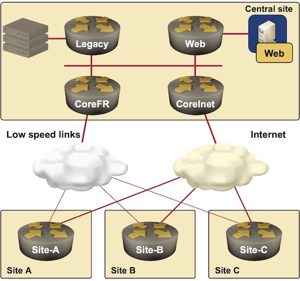

title: Sample Network

The sample network that will be used in all the printouts and configuration examples is a redundant hub-and-spoke network where each remote site connects to the central location via a high-speed GRE-over-Internet connection and a lower-speed Frame Relay link (don't ask, it's an old example, but the principles and configurations are as valid as ever).

The central site has two core routers (one concentrating the Internet connections, the other one serving as the Frame Relay hub) and two distribution-layer routers. The network schematics are displayed in the next figure.

NOTE: In a live network, you’d use IPSec in combination with GRE tunnels, but it’s not included in the configuration samples to reduce the overall complexity.

Management would like all traffic to and from the Legacy server farm (for example, TN3270 sessions or low-volume client-server transactions) to flow over the lower-speed links, while the new flashy Web applications should use the high-speed link. Obviously, all applications should be able to use either one of the links in case of link failure.

NOTE: In a well-designed network, non-critical bandwidth-intensive applications would be blocked from using the lower-speed link.

The rest of the article covers the basic BGP design and associated router configurations that you can use in any large-scale network and the changes made to the BGP design to support the desired policy routing.
