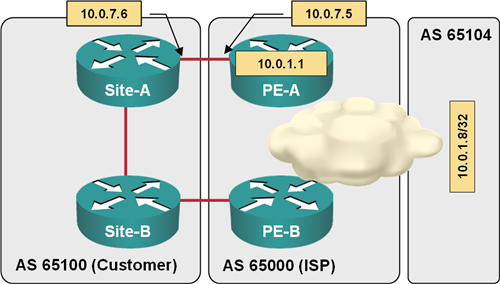
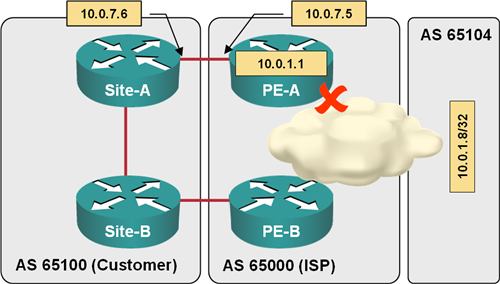

title: Default Routes in BGP

The primary mission of Border Gateway Protocol (BGP) (transport of Internet routing between ISPs) has influenced the implementation of BGP default route origination, advertisements and propagation. This article describes the functionality and caveats of BGP default routing. All router configurations and printouts are taken from a sample network illustrated in the following diagram:

<figure markdown='1'>
  
  <figcaption>Test network used to produce the printouts in this article</figcaption>
</figure>

## Default Route Origination in BGP

Contrary to some other routing protocols, you cannot redistribute default route (0.0.0.0/0) from the IP routing table into BGP.

For example, if PE-A has a static default route …

```
PE-A#show ip route static | begin Gateway
Gateway of last resort is 10.0.7.6 to network 0.0.0.0
S* 0.0.0.0/0 [1/0] via 10.0.7.6
      10.0.0.0/8 is variably subnetted, 31 subnets, 3 masks
S 10.2.17.0/24 [1/0] via 10.0.1.6
```

… and you have configured redistribution of static routes into BGP …

```
router bgp 65000
 address-family ipv4
  network 10.0.1.1 mask 255.255.255.255
  redistribute static
```

… the default route will not appear in the BGP table (but all other static routes will).

```
PE-A#show ip bgp | include Network|32768
   Network          Next Hop            Metric LocPrf Weight Path
*> 10.0.1.1/32      0.0.0.0                  0         32768 i
*> 10.2.17.0/24     0.0.0.0                  0         32768 ?
```

To originate the default route into the BGP table you should use the **network** statement:

```
router bgp 65000
 address-family ipv4
  network 0.0.0.0
```

After the network statement for the default route has been configured, BGP inserts the prefix 0.0.0.0/0 into the BGP table:

```
PE-A#show ip bgp | include Network|32768
BGP table version is 13, local router ID is 10.0.1.1
Status codes: s suppressed, d damped, h history, * valid, > best, i - internal,
              r RIB-fa              
Origin codes: i - IGP, e - EGP, ? - incomplete

   Network          Next Hop            Metric LocPrf Weight Path
*> 0.0.0.0          0.0.0.0                  0         32768 i
*> 10.0.1.1/32      0.0.0.0                  0         32768 i
*> 10.2.17.0/24     0.0.0.0                  0         32768 ?
```

WARN: Unless you have a very specific design, it's probably a bad idea to insert the default route into the BGP table of an Internet Service Provider router; this technique should only be used to reduce the BGP table size in private networks using BGP as the core routing protocol.

## Default Route Propagation

Once the default route has been inserted in the BGP table, the router propagates it like any other IP prefix. For example, after the default route has been inserted in the BGP table of PE-A, it’s automatically propagated to Site-A. The following printout also illustrates that the Site-A router has received the default route from PE-A as well as through PE-B and Site-B routers; the default route is thus propagated on IBGP and EBGP sessions.

```
Site-A#show ip bgp 0.0.0.0
BGP routing table entry for 0.0.0.0/0, version 13
Paths: (2 available, best #2, table Default-IP-Routing-Table)
Flag: 0x820
  Advertised to update-groups:
        1
  65000
    10.0.8.2 from 10.0.8.2 (10.0.1.4)
      Origin IGP, localpref 100, valid, internal
  65000
    10.0.7.5 from 10.0.7.5 (10.0.1.1)
      Origin IGP, metric 0, localpref 100, valid, external, best
```

WARN: Older IOS releases did not propagate default routes; even if a BGP default route would have been in the BGP table, it would not be advertised to BGP neighbors.

## Default Route in Outbound Advertisement

In most design scenarios, you’d like to advertise the BGP default route to EBGP neighbors without having a BGP default route in your own BGP table. For example, an ISP might decide to advertise only the BGP default route and local BGP networks to customers multi-homed to a single ISP. To advertise a BGP default route to a BGP neighbor, use the **neighbor default-originate** router configuration command.

For example, when the IP prefix 0.0.0.0/0 is removed from the BGP table with the **no network** command and the default route advertisement is configured on EBGP session from PE-A to Site-A …

```
router bgp 65000
 address-family ipv4
  no network 0.0.0.0
  neighbor 10.0.7.6 default-originate
```

… Site-A still receives the default route.

```
Site-A#show ip bgp 0.0.0.0
BGP routing table entry for 0.0.0.0/0, version 16
Paths: (1 available, best #1, table Default-IP-Routing-Table)
Flag: 0x820
  Advertised to update-groups:
        1
  65000
    10.0.7.5 from 10.0.7.5 (10.0.1.1)
      Origin IGP, metric 0, localpref 100, valid, external, best
```

## Conditional Default Route Advertisement

The unconditional default route advertisement from PE router to CE routers could lead to traffic black holes. If PE-A loses connectivity to the network core (see the next diagram) but still advertises the default route to Site-A, it will attract the traffic from AS 65100 and subsequently drop it due to failed uplink. It’s thus best to configure conditional advertising of the BGP default route to BGP neighbors.

<figure markdown='1'>
  
  <figcaption>Default route is still advertised after an uplink failure</figcaption>
</figure>

In the sample network, the presence of the IP prefix 10.0.1.8/32 originated in AS 65104 indicates that the core network is available. To configure conditional BGP default route advertisement, you have to:

-   Configure an IP access list or IP prefix list that exactly matches the desired IP prefix in the IP routing table.

```
ip prefix-list CoreNet seq 5 permit 10.0.1.8/32
```

-   Configure a route map using the access list or prefix list to match the IP prefix. The route map can contain other **match** clauses. In our example, it also matches the AS path with an AS-path access list:

```
route-map Default_From_65104 permit 10
 match ip address prefix-list CoreNet
 match as-path 100
!
ip as-path access-list 100 permit _65104$
```

-   Configure conditional advertising of the default route with the **neighbor default-originate route-map** configuration command.

```
router bgp 65000
 address-family ipv4
  neighbor 10.0.7.6 default-originate route-map Default_From_65104
```
