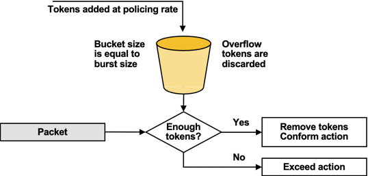

title: QoS Policing

The activity called *policing* or *rate limiting* in various QoS implementations is a *traffic contract conformance measurement* that can result in *marking* (changing QoS attributes of individual packets in the traffic flow) or *policing* (dropping of packets violating the traffic contract).

This document describes various algorithms used to implement traffic measurement and rate limiting on non-distributed platforms using software packet switching (including most routers running Cisco IOS). While the document focuses primarily on Cisco IOS implementations, the same concepts apply to most other implementations. Platforms using hardware-based packet switching might use different algorithms depending on the hardware QoS implementations.

## Cisco IOS Implementations

Cisco IOS implements policing/marking functionality with two unrelated mechanisms:

-   The **rate-limit** command implements per-interface input- and output-rate limiting.
-   The **police** command implements the traffic measurement within the scope of the Modular QoS Command Line Interface (MQC).

**Rate-limit** commands and QoS **policy-maps** containing the **police** command can measure inbound or outbound packets on physical or logical interfaces (tunnels, subinterfaces). They introduce no delay (apart from slightly increased CPU load on the router) in the packet forwarding mechanism.

### Rate-limit command

The **rate-limit** interface configuration command can match packets based on IP access lists, IP precedence settings, DSCP settings, QoS groups or source MAC addresses. It can set the IP precedence, DSCP or MPLS QoS bits in the measured packets, or group the packets into QoS groups.

The **rate-limit** command uses dual token bucket mechanism and drops all packets that exceed the excess burst size.

### Police action

The **police** action specified within a **class** in a **policy-map** can use three different measurement mechanisms:

-   Single token bucket measurement is used when the **police** command specifies only the **conform** and **exceed** actions.
-   Dual token bucket measurement is used to support **conform**, **exceed** and **violate** actions.
-   Dual-rate dual token bucket measurement is used when the **police** command specifies **cir** and **pir** rates.

As the traffic measurement takes place within a traffic class defined by a **class-map**, any criteria supported by the **class-map** configuration command can be used to define the traffic class.

Each **police** command can specify three types of actions:

-   The **conform** action is executed for packets within the average rate and burst size.
-   The **exceed** action for a **police** command specifying traffic **rate** is executed for packets within the average rate and excess burst size.
-   The **exceed** action for a **police** command specifying **pir** rate is executed for packets within the excess rate and excess burst size.
-   The **violate** action is executed for packets that exceed excess rate/burst size.

The actions executed by the **police** command can pass the packet unmodified, drop it or mark it. The following QoS attributes of a packet can be modified:

-   IP precedence;
-   IP Differentiated Services Control Point (DSCP);
-   Discard class (within the DSCP field);
-   ATM Cell Loss Priority (CLP) – used only for packets transmitted over an ATM interface;
-   Ethernet 802.1q Class of Services (CoS) marking;
-   MPLS QoS (experimental) bits – used only for MPLS-encapsulated packets;
-   Frame Relay Discard Eligibility (DE) bit – used only for packets transmitted over an outbound Frame Relay interface;
-   QoS group (an extra marker internal to the router).

## Measurement Mechanisms

The traffic contracts conformance measurement is usually performed with a *token bucket* algorithm:

-   The token bucket *size* defines the initial *burst size* that can exceed the average rate.
-   Tokens (conforming-bytes or conforming-packets) are added to the bucket at a constant rate (the average traffic arrival/departure rate). Tokens exceeding the bucket size are dropped.
-   Each conforming packet consumes the tokens relative to its size (when measuring packet rate, each packet consumes a single token). Packets exceeding the traffic contract do not consume tokens.

### Single Token Bucket Algorithm

The single token bucket algorithm is used for simple traffic contracts that differentiate the measured packets into conforming and non-conforming. The **police** command using a single token bucket algorithm can specify:

-   Average traffic bit rate with the **rate _speed_ bps** parameter or **rate _percentage_ percent** parameter.

NOTE: The rate specified with the **percent** parameter is calculated based on the **bandwidth** settings of the interface to which the **policy-map** is applied.

-   Average packet rate with the **rate _number_ pps** parameter.
-   Burst size with the **burst _size_** parameter.
-   Conform and exceed actions with the **conform-action** and **exceed-action** keywords.

NOTE: Recent Cisco IOS releases support multiple **conform-action** and **exceed-action** commands.

The single token bucket algorithm is illustrated in the following figure:

<figure markdown='1'>
  
  <figcaption>Single token bucket measurements</figcaption>
</figure>

To optimize the token bucket algorithm, the tokens are added to the bucket at the packet arrival time using the following formula: Bucket<sub>new</sub> = Min(BurstSize,Bucket<sub>Old</sub> + Interpacket-Time \* MeasurementRate)

**Example:** the following router configuration measures the web traffic received through a serial interface and drops all packets exceeding the 512000 bps average rate:

```
class-map match-any Web
 match protocol http
 match protocol secure-http
 !
policy-map MeasureWeb
 class Web
   police rate 512000 bps
     conform-action transmit
     exceed-action drop
!
interface Serial1/0
 service-policy input MeasureWeb
```

### Dual Token Bucket Algorithm

Slightly more flexible traffic contracts might allow extra (best-effort) packets beyond the average rate/burst size specification. These packets are usually marked differently from the in-contract packets and transported across the network only if it's not congested. In most scenarios, the extra packets are allowed only in the initial burst (long-term traffic rate cannot exceed the average rate) and are measured with an extra token bucket (exceed bucket) as shown in the following diagram:

<figure markdown='1'>
  
  <figcaption>Dual token bucket measurements</figcaption>
</figure>

Dual token bucket contracts are common in ATM environments (where the excess cells are marked with CLP bits) and Frame Relay environments (where the excess frames are marked with the DE bit).

The dual token bucket algorithm is used by the **rate-limit** command specifying the **exceed** option and the **police** command specifying the **exceed-action** and **violate-action**. In both cases, the size of the excess burst (but not the average excess rate) can be set.

**Example:** The following router configuration allows e-mails to be sent at line speed if the size of the transfer does not exceed 100 kilobytes. However, the packets exceeding the 128kbps average rate and the 16 kilobytes initial burst size will be marked with a different DSCP value.

```
class-map match-any Mail
 match protocol smtp
 !
policy-map LimitEmails
 class Mail
   police rate 128000 burst 16000 peak-burst 100000
     conform-action transmit
     exceed-action set-dscp-transmit af13
     violate-action drop
```

### Dual Rate Policing

In Frame Relay environment, the traffic contracts commonly specify average rate (Committed Information Rate – CIR) as well as constant excess rate (Excess Information Rate – EIR – or Peak Information Rate – PIR) that the customers can use.

The EIR mechanism is different from the excess burst size; the excess burst prolongs the initial packet burst (marking some packets as exceeding the contract) while the EIR allows long-term transmission of excess (best-effort) packets.

The CIR/EIR or CIR/PIR policing requires two independent token buckets as shown in the following diagram. Each bucket independently measures the traffic conformance to the average or peak/excess rate; there is no overflow from the *conforming* bucket to the *excess* bucket.

<figure markdown='1'>
  
  <figcaption>Dual-rate token bucket measurements</figcaption>
</figure>

The dual rate policing is configured with the **police** command specifying **cir** and **pir** rates or **rate** and **peak-rate** parameters. In both cases, you can specify the **burst** size and the **peak-burst** size (they could be different). You also have to specify **conform-action**, **exceed-action** and **violate-action**; without the **violate-action**, the single token bucket measurement will be used.

**Example:** The following service policy can be used on a Frame Relay interface to set the DE bits on excess packets and drop out-of-contract packets:

```
policy-map FrameRelay
 class class-default
   police cir 128000 pir 256000
     conform-action transmit
     exceed-action set-frde-transmit
     violate-action drop
!
interface serial 1/0.1
 frame-relay interface-dlci 100
 service-policy output FrameRelay
```

<!-- Source of diagrams: Wiki/Archive/QoS Mechanisms in Cisco IOS -->
