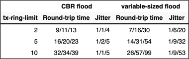
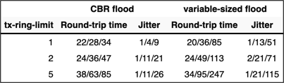

title: Impact of Transmit Ring Size (tx-ring-limit)

Output interface queues in most software switching platforms contain a software-only component and a FIFO queue shared between the CPU and the outgoing interface. That FIFO queue is usually organized as a ring structure, and its maximum size can be controlled with the **tx-ring-limit** parameter in Cisco IOS.

The impact of that parameter should be obvious: larger **tx-ring-limit** values cause more delay and jitter, resulting in reduced quality-of-service of time-critical applications (like voice-over-IP) over low-speed interfaces. A series of tests performed in a small tightly controlled test-bed quantifies the actual impact.

## Overview

The default value of **tx-ring-limit** is a good compromise between the latency/jitter requirements of medium speed links and increased CPU utilization due to I/O interrupts caused by low tx-ring-limit values. On low-speed links (128 kbps and below), the **tx-ring-limit** should be decreased to 1.

## Test bed

Two 2800-series routers were connected with a back-to-back serial link, one of them generating the clock. PPP encapsulation was used on the serial link. A traffic-generating node was connected to the Ethernet port of one of the routers to generate the background load. IP SLA using ICMP echo packets was started on the same router to measure response time and jitter of a simple request-response application (ICMP ping).

## Router configurations

Minimum router configurations were used with no dynamic routing. The relevant parts of router configurations are displayed below:

```
hostname a1
!
ip cef
!
class-map match-all Echo
 match protocol icmp
!
policy-map EchoPriority
 class Echo
  priority 64
 class class-default
  fair-queue
!
interface FastEthernet0/0
 ip address 10.0.0.5 255.255.255.0
!
interface Serial0/1/0
 bandwidth 512
 ip address 172.16.1.129 255.255.255.252
 encapsulation ppp
 load-interval 30
 service-policy output EchoPriority
!
end
```
CAPTION: Configuration of the IP SLA originating router

The second router has an almost identical configuration (with different IP addresses).

## Load generation

UDP flooding implemented in PERL was used to generate the background load and saturate the WAN interface. 

Two sets of measurements were performed. In the first test, a continuous flood of constantly-spaced fixed-size packets sent to a single UDP port was generated (similar to constant bit rate traffic). This traffic stream generated a single conversation in the fair queuing model used on the WAN interface.

NOTE: Cisco IOS uses [fair queuing](Fair_Queuing.html) as soon as a service policy including a queuing action is configured on an interface.

The second test flooded the WAN link with variable-sized packets sent at a fixed interval to random destination UDP ports. The generated bandwidth varied widely due to random packet sizes and the traffic stream generated hundreds of conversations in the fair queuing structure.

In both cases, the CPU utilization was measured on *a1* and *a2* to verify that the CPU load does not increase 50% (high CPU load could impact the jitter measurements).

```
a1#show proc cpu | inc CPU
CPU utilization for five seconds: 8%/6%; one minute: 8%; five minutes: 5%
```

```
a2#sh proc cpu | inc CPU
CPU utilization for five seconds: 20%/10%; one minute: 12%; five minutes: 8%
```

## Response time and jitter measurement

An IP SLA probe was configured on one of the routers generating small ICMP ECHO packets that were sent over the WAN link. The ICMP traffic is classified as **priority** traffic in the service policy attached to the WAN interface ensuring that the ICMP packets enter the hardware queue prior to any packets generated by the UDP flood. The measured delay and jitter is thus solely the result of the hardware queue between the software fair queuing structures and the interface hardware.

```
ip sla 50000
 icmp-jitter 172.16.1.130
 timeout 1000
 threshold 500
 frequency 2
 history hours-of-statistics-kept 1
 history distributions-of-statistics-kept 2
```

The IP SLA probe was started after the test load has reached a steady state (saturated WAN interface) and the aggregated SLA statistics were inspected while the load was still present. The **show ip sla statistics aggregated** command was used to inspect the statistics and the RTT and source-to-destination jitter values were collected

```
a1#show ip sla statistics aggregated

Round Trip Time (RTT) for       Index 50000
Start Time Index: 13:15:22.851 UTC Fri Apr 18 2008
Type of operation: icmpJitter
RTT Values:
        Number Of RTT: 387              RTT Min/Avg/Max: 6/15/31
Latency one-way time:
        Number of Latency one-way Samples: 0
        Source to Destination Latency one way Min/Avg/Max: 0/0/0
        Destination to Source Latency one way Min/Avg/Max: 0/0/0
Jitter Time:
        Number of Jitter Samples: 334
        Source to Destination Jitter Min/Avg/Max: 1/6/23
        Destination to Source Jitter Min/Avg/Max: 1/1/1
```

## Test results

The tests were performed at line speeds of 128 and 512 kbps with different **tx-ring-limit** settings. The **tx-ring-limit** values were changed at both ends of the WAN link.

The test result values are triplets: minimum, average and maximum measured value as reported by IP SLA.

<figure markdown='1'>
  
  <figcaption>Test results at 512 kbps</figcaption>
</figure>

<figure markdown='1'>
  
  <figcaption>Test results at 128 kbps</figcaption>
</figure>

  
